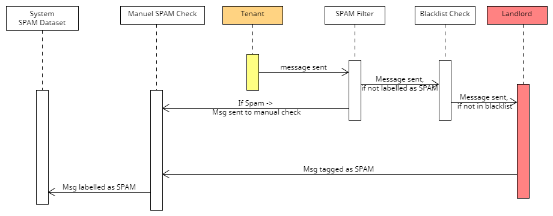
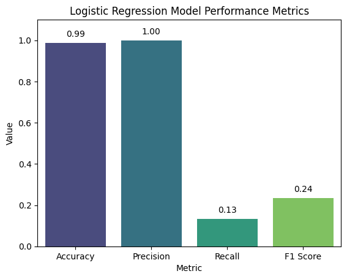
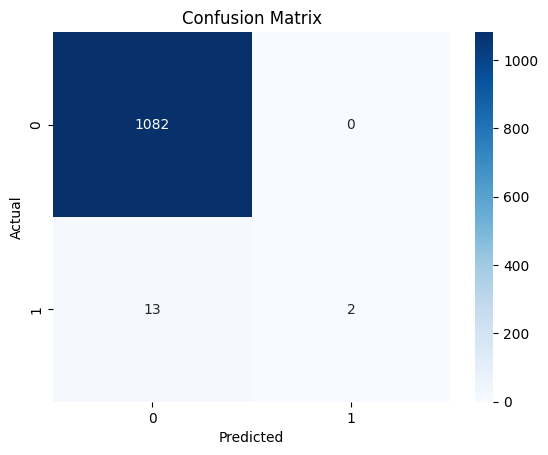
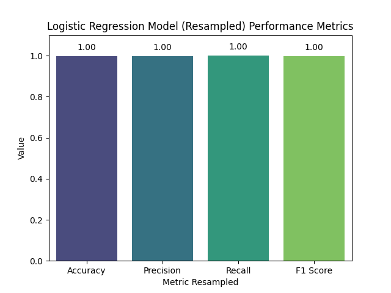
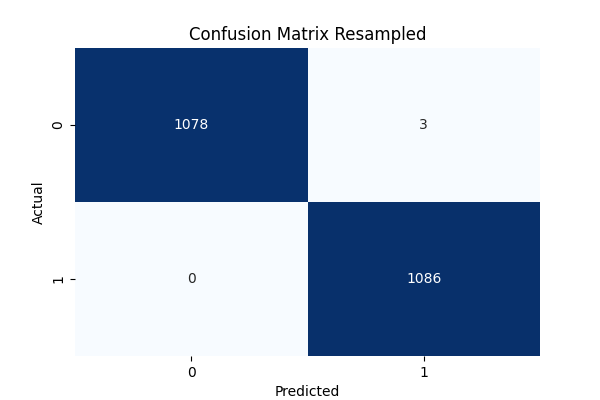

<H1>Spam Projekt , IKT SS24, Irina Ukhanova</H1>

 <b>Klassifikation von Spam-Buchungsanfragen auf einem Immobilienportal</b>

 Das Ziel dieses Projekts ist es, die Sicherheit von Buchungsanfragen auf einem Immobilienportal zu erhöhen, indem anfällige und gefährliche Anfragen automatisch vom System erkannt und blockiert werden. Hierbei sollen ML-Techniken angewendet werden, um legitime Buchungsanfragen von Spam zu unterscheiden. Dies schützt sowohl das Unternehmen als auch die Nutzer vor potenziellen Betrugsversuchen und anderen schädlichen Aktivitäten.

<b>Datensatz: </b> Ein unternehmensinterner Datensatz, der Spam-Buchungsanfragen enthält. Dieser Datensatz besteht aus Inhalt der Nachricht und Spam/nicht Spam Labels

<b>ML-Instrumente: </b> 
<li> Logistische Regression</li>
<li> Cross Validation</li>
<li> Oversampling</li>

 <b>Erkenntnisse </b> 
Das Modell zeigt eine hohe Präzision und Genauigkeit und kann gut zwischen positiven und negativen Klassen unterscheiden. Es zeigt aber auch False Positives (3). Dies ist zwar eine sehr geringe Anzahl, aber für dieses Geschäftsmodell sind False Positives kritisch, da sie bedeuten, dass Nachrichten, die kein Spam sind, als Spam blockiert werden: zu viele False Positives können das Vertrauen der Benutzer in das System beeinträchtigen.
Da die Kreuzvalidierung sehr gute Ergebnisse zeigt und auch die allgemeinen Metriken nach dem Oversampling sehr gut sind, deuten die allgemeinen Ergebnisse nicht direkt auf Overfitting hin. Daher kann man weitere mögliche Schritte vornehmen:
<li>Entscheidungsschwellenwert für Logistische Regression anpassen um False Positives zu reduzieren (Nachteil - möglicherweise auf Kosten der Steigerung von False  Negatives)</li>
<li>Qualität der Datensatz erhöhen -  mit weiteren realen Daten erweitern, jetzt sind die Daten etwa verrauscht </li>
<li>ein komplexeres Modell ausprobieren (z.B. Random Forest)</li>

<a href = "SpamKlassifikationPrasentation.pdf"> Präsentation des Projekts July 2024</a>   
<a href = "https://spamornotp4g.streamlit.app/"> Streamlit App </a>   
   

 <h2>Sprint 1: Problemdefinition und Prozessexploration</h2>

 <b>Ziel: </b> 

Problem und Status Quo Prozesse im Unternehmen besser verstehen 

 <b>Aufgaben: </b>

<li>Status Quo Prozess von Spamerkennung von Nachrichten erkennen und beschreiben </li>
<li>Ziel des Projekt definieren - alle Spam-Nachrichten auffangen</li> 

 <b>Ergebnis: </b> 

<li>Flowchart von Prozessen</li>
<li>Problem ist klar dargestellt, Ziel definiert - alle Spam-Nachrichten auffangen</li>

 <h2>Sprint 2: Datenvorbereitung und Exploration</h2>

 <b>Ziel: </b> 
Datenaufbereitung und erste Explorative Datenanalysen. 

 <b>Aufgaben: </b>
<li>Datensammlung und -import: Die Daten wurden aus der Unternehmensdatenbank heruntergeladen. Der Datensatz ist mit 0 für Nicht-Spam und mit 1 für Spam gekennzeichnet.</li>
<li>Datenbereinigung</li>
<table>
  <tr>
    <th>Nicht Spam</th>
    <th>Spam</th>
  </tr>
  <tr>
    <td>5416</td>
    <td>68</td>
  </tr>
</table>

 Ergebnis: 
<li> Sauberer und explorierter <a href = "spam_nichtspam_datensatz.csv"> Datensatz </a>.   </li>

 <b>Erkenntnisse </b> 
<li>Mehr als 45 % der Spam-Anfragen werden vom vorhandenen Spam-Filter nicht abgefangen.</li>
  

 <h2>Sprint 3: Evaluierung vom Datensatz als Baseline</h2>

 <b>Ziel:  </b> 
Evaluieren des Datensatzes für Anwendung von jetzigen Spam-Filtern

 <b>Aufgaben:  </b>
<li>Ein Skript erstellen, um die Effektivität vom Spam-Filetr zu prüfen  </li>

 <b>Ergebnis: </b>
<li> <a href = "baseline_vs_model.py"> Skript </a></li>
<li> <table>
     <tr>
    <td> </td>
    <td>Spam-Filter</td>
    <td>Datensatz</td>
  </tr>
  <tr>
    <td> Anzahl von Spam-Nachrichten:</td>
    <td>38</td>
     <td>68</td>
  </tr>
  <tr>
    <td> Anzahl von Nicht-Spam-Nachrichten:</td>
    <td>5447</td>
     <td>5416</td>
  </tr>
</table>

 <h2>Sprint 4: Modellentwicklung und erste Evaluierung</h2>

 <b>Ziel: Erstellen und evaluieren eines ersten Machine Learning Modells.</b> 

 <b>Aufgaben:  </b>
<li>Auswahl des Baseline-Modells -  sklearn.linear_model -> Logistische Regression </li>
<li>Datensplit (Trainings- und Testdatensatz). Sklearn.model_selection -> train_test_split</li>
<li>Metriken definieren (Accuracy, Precision, Recall, F1 Score)</li>
<li>Training und erste Evaluierung des Modells.</li>

 <b>Ergebnis:  </b>
<li>Trainingssetgröße:4387</li>
<li>Testsetgröße:1097</li>
<li>Genauigkeit: 0.9881494986326345</li>
<li>Precision: 1.0</li>
<li>Recall: 0.13333333333333333</li>
<li>F1 Score: 0.23529411764705882 </li>
<li>Confusion Matrix: [[1082    0]  
 [  13    2]] </li>

 <b>Erkenntnisse zur Verbesserung des Modells.</b> 
<li>Genauigkeit ist sehr hoch, kann aber irreführend bei ungewogenen Daten sein.</li>
<li>Precision ist ideal</li>
<li>Recall - es wurde nur 13% der tatsächlichen positiven Fälle korrekt identifiziert. Dies ist relativ niedrig und weist auf viele falsch negative Vorhersagen hin.</li>
<li>F1 - es gibt ein Gleichgewicht zwischen Precision und Recall, aber es deutet darauf hin, dass das Modell in Bezug auf die True Positives und False Negatives verbessert werden muss.</li>
<li>Der niedrige Recall-Wert von 0.13 und der niedrige F1-Score von 0.24 deuten darauf hin, dass das Modell viele tatsächliche positive Fälle nicht erkennt. Dies ist problematisch, weil das Erkennen aller positiven Fälle wichtig für Business ist.</li>
<li>Das Hauptproblem ist wahrscheinlich der Datensatz, die Daten sind unausgewogen, der SPAM-Anteil ist viel kleiner als der Nicht-Spam-Anteil. </li>

 <b>To Do:</b> 
<li>Cross Validation -um  eine verlässliche Schätzung der Modellperformance auf neuen Daten zu geben und Variabilität der Modellleistung zu bewerten.</li>

 <h2>Sprint 5: Cross Validation</h2>

 <b>Stratified K-Fold Cross Validation auf 5 Folds</b> 
<li>Cross-Validation Scores: [0.98723792 0.98723792 0.98723792 0.9881495  0.98813869]</li>
<li>Mittlere Performanz auf 5 Folds:  0.9876003899154296</li>
<li>Standardabweichung der Performanz: 0.00044394437241151524</li>

 <b>Erkenntnisse:</b> 
<li>Die Kreuzvalidierung zeigt, dass das Modell sehr gute Ergebnisse liefert und robust ist. Allerdings weisen der niedrige Recall und der niedrige F1-Score zusammen mit  auf das Problem der Klassenungleichgewichte hin. </li>

 <b>To Do:</b> 
<li>Korrektur des Klassenungleichgewichts - Data Augmentation  </li>

 <h2>Sprint 6: Augmentation der Daten und neue Modellentwicklung</h2>

 <b>Ziel: Erweiterung von Daten  und evaluieren des Machine Learning Modells.</b> 

 <b>Aufgaben:  </b>
<li>Augmentation - Über-Sampling-Methode SMOTE anwenden, es generiert synthetische Beispiele für die Minderheitsklasse, damit Klassenungleichgewicht ausgeglichen wird - imblearn`-Bibliothek (SMOTE - Synthetic Minority Over-sampling Technique)</li>
<li>Datensplit (Trainings- und Testdatensatz). Sklearn.model_selection -> train_test_split</li>
<li>Metriken definieren (Accuracy, Precision, Recall, F1 Score)</li>
<li>Training und Evaluierung des Modells.</li>

 <b>Ergebnis:  </b>
<li>Über-Sampling Trainingssetgröße:8665</li>
<li>Über-Sampling Testsetgröße:2167</li>
<li>Genauigkeit Über-Sampling: 0.9986155976003692</li>
<li>Precision Resample: 0.9972451790633609</li>
<li>Recall Resample: 1.0</li>
<li>F1 Score Resample: 0.9986206896551724</li>
<li>Confusion Matrix Resample: [[1078    3] 
 [   0 1086]]</li>

 

  
 <b>Erkenntnisse:</b> 
<li>Das Model zeigt hohe Präzision und Genauigkeit und gut in der Lage ist, zwischen positiven und negativen Klassen zu unterscheiden.Das Model weist aber auf False Positives (3) auf. Das ist zwar  eine sehr niedrige Anzahl aber für diesen Business sind False Positives kritisch, weil es heißt dann, das die Nachrichten die nicht Spam sind werden als Spam blockiert: zu viele False Positives können das Vertrauen der Benutzer in ein System beeinträchtigen.  </li>

 <h2>Sprint 7: Auswertung des Models in vergleich zum Baseline</h2>

 <b>Ziel: Ergebnisse von Spam-Filter und Modellvorhersage zu vergleichen.</b> 

 <b>Ergebnis: </b>
<li> <a href = "baseline_vs_model.py"> Skript </a></li>
<li> <table>
     <tr>
    <td> </td>
    <td>Spam-Filter</td>
    <td>Modellvorhersage</td>
    <td>Datensatz</td>
  </tr>
  <tr>
    <td> Anzahl von Spam-Nachrichten:</td>
    <td>38</td>
      <td>77</td>
     <td>68</td>
  </tr>
  <tr>
    <td> Anzahl von Nicht-Spam-Nachrichten:</td>
    <td>5447</td>
      <td>5407</td>
     <td>5416</td>
  </tr>
</table>

 <b>Erkenntnisse </b> 
<li>Das Vorhersage-Modell kann sehr gut richtigen Spam identifizieren aber es werden auch dabei eine kleine Anzahl von Nicht-Spam Nachrichten als Spam gefiltered. Also ist das Modell muss weitertrainirt werden. Da Kreuzvalidierung sehr gute Ergebnisse zeigt, deuten die Ergebnisse nicht direkt auf Overfitting hin.  </li>
<li> Ausblick:  </li>
<ul> ein anderes Modell ausprobieren (z.B. Random Forest) </ul>
<ul> Datensatz mit weiteren echten Daten erweitern  </ul>
  

 <h2>Sprint 8: Implementierung der Streamlit App </h2>

 <b>Ziel: Implementierung der Streamlit App. </b> 

 <b>Aufgaben: </b> 
<li> Grundgerüst der Streamlit App erstellen. </li>
<li> Datenexploration in der App darstellen. </li>
<li>  Modellvorhersagen in der App integrieren. </li>

 <b>Ergebnis: </b>
<li> Funktionsfähige <a href = "https://spamornotp4g.streamlit.app/"> Streamlit App </a>   . </li>
<li> Interaktive Modellvorhersagen. </li>
